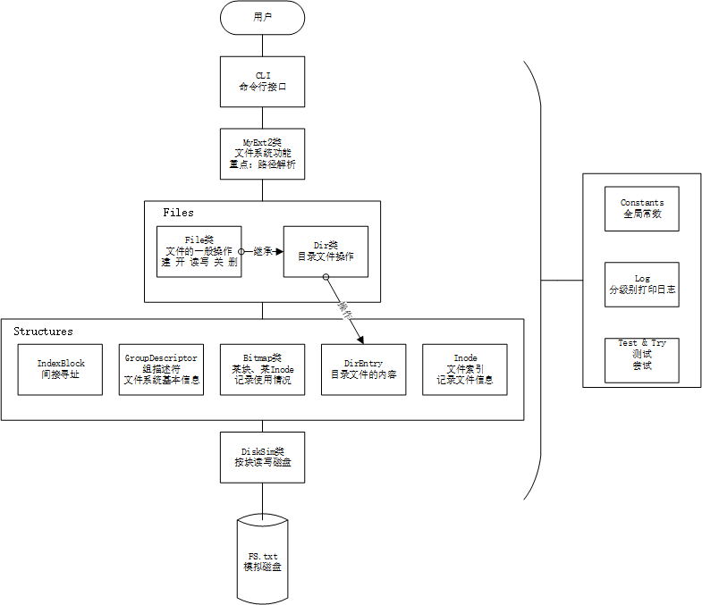

# 类Ext2文件系统

## 背景

操作系统实验, 第三次实验的产物.

## 简介

在当前文件系统下创建一个文件FS.txt, 用以模拟磁盘空间, 并在其内部建立一个文件系统;  
其包含Ext2的基本结构, 如组描述符、inode、dir entry等.  
实现了文件系统的基本功能, 如格式化、新建及删除文件(夹)、ls、cd、读写权限等.  
实现了类似Linux命令格式的命令行, 包括format、ls、cd、mkdir、chmod等, 便于使用.

## 环境及依赖

依赖stl  
使用MSVC++17可以编译通过

## 命令行用法

### 初始化

程序的argv[1]被当作用户名显示, 默认为"root"  
进入程序后, 若当前文件夹中无FS.txt, 会提示进行格式化;  
格式化时所输入的名称是文件系统名, 将被写入组描述符中, 不能超过16字节.  
若格式化完成, 则会显示  

> 用户名@文件系统名:当前路径$ 

例如:
> root@MyExt2:/$ 

此时就可以使用如下命令:

### 命令

1. ls  [dir|file|path]*  
列出若干个文件夹or文件的详细信息;  
若无参数, 则列出当前文件夹.

2. cd [path]?  
转移至目标目录, 支持绝对路径与相对路径;  
若无参数, 则不做操作.  

3. mkdir [dir]+  
在当前目录下, 新建若干个文件夹;  
若无参数, 回显报错.  

4. create [file]+  
在当前目录下, 新建若干个文件;  
若无参数, 回显报错.  

5. rm [dir|file|path]+  
删除若干个文件/文件夹;  
若无参数, 回显报错.  

6. read [file|path]+  
以字符串形式, 读取并显示若干个文件的内容;  
若无参数, 回显报错.  

7. write [file]  
以字符串形式, 写入一个文件;  
若无参数, 回显报错.

8. format  
格式化文件系统.  

9. chmod [mod] [file|dir|path]  
更改文件rwx权限;  
mod为0~7的数字, 代表rwx权限; 后接文件名.  

10. [quit|exit]  
退出文件系统.

## 文档

[文档](./doc) 中包含结构图、实验要求、现场验收表、实验报告等  
  

## TODO

1. log的分级显示

2. 错误处理的传递路径错综复杂, 且格式不统一

3. bug: 使用相对路径时省略开头的"./"可能带来问题

4. CLI中命令使用else if排列, 可扩展性较差

5. 没有对已解析的路径进行缓存, 可能影响性能

6. 没有为其它应用程序提供线程安全的API  

7. 恰逢期末, 实验完成匆忙, 未进行单元测试